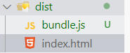

# TypeScript

# 第一章 简介

- TypeScript 是什么
  1. 以 JavaScript 为基础构建的语言
  2. 一个 JavaScript 的超集
  3. 可以在任何支持 JavaScript 的平台中执行
  4. TypeScript 为 JavaScript 提供了扩展，并添加了 **类型**
  5. TS 不能直接被 JS 直接执行 - 需要编译
- 对比 JavaScript 增加的知识点
  1. 类型
  2. 支持 ES6 的新特性
  3. 强大的开发工具
  4. 添加 ES 不具备的新特性
  5. 丰富的配置选项

## 1.1 开发环境搭建

1. 下载 node.JS

2. 安装 node.JS

3. 使用 npm 全局安装 TypeScript

   ```
   npm i -g typescript
   ```

4. 创建一个 ts 文件

5. 使用 tsc命令 对 ts 文件进行编译

   ```javascript
   tsc xxx.ts
   ```

# 第二章 基本类型

- 类型声明

  - 是 TS 非常重要的一个特点

  - 通过类型声明可以指定 TS 中变量 (参数,形参) 的类型

  - 指定类型后，当为变量赋值时，TS 编译器会自动检查值是否符合**类型声明，符合则赋值，否则报错**

  - 简而言之，类型声明给变量设置了类型，使得变量**只能存储某种类型**的值

  - 语法

    ```typescript
    let 变量:类型;
    let 变量:类型 = 值;
    function fn(参数:类型):返回值类型{
    }
    ```

- 自动类型判断

  - TS 拥有自动的类型判断机制
  - 当对变量的声明和赋值是同时进行的时，TS 编译器会自动**判断变量的类型**

- 实例

  ```typescript
  //类型声明
  
  //--------------------
  //使用 JS 的语法声明变量
  let a;
  
  a = 123; 
  a = '巴御前';
  
  //使用 TS 的语法在声明变量时声明类型
  let b: string;
  
  b = '巴御前天下第一';
  // b = 123; //报错 - 不能将类型“number”分配给类型“string”
  
  //--------------------
  //如果需要声明和赋值同时进行
  let c : boolean = false;
  c = true;
  // c = 1; //不能将类型“number”分配给类型“boolean”
  
  //TS 优化：当声明和赋值同时进行时，类型声明可以不写，TS 会自动推断
  let d = '巴御前天下第一';
  // d = {}; //不能将类型“{}”分配给类型“string”
  
  //---------------------
  /* 
  JS 中的函数是不考虑参数的类型和个数的
  TS 中可以在形参后面加上对应的类型，限制调用函数时传入的实参类型
  */
  function sum(a: number,b: number){
      return a + b;
  }
  
  // sum(123); //TS 函数调用提示：应有 2 个参数，但获得 1 个。ts(2554)
  // sum(123,456,789); //TS 函数调用提示：应有 2 个参数，但获得 3 个。ts(2554)
  // sum("123","456"); //TS 函数调用提示：类型“string”的参数不能赋给类型“number”的参数。ts(2345)
  
  //----------------------
  //TS 中的函数也可以限制函数的返回值类型
  function pow(a: number,b: number):number{
      //不写返回值会报错
      //返回值类型错误会报错
      // return 'why';
      return a ** b;
  }
  
  //用来接收返回值的变量会自动进行类型推断
  let result = pow(4,2);
  // result = ''; //不能将类型“string”分配给类型“number”
  ```

- 类型

|  类型   |        例子        |              描述               |
| :-----: | :----------------: | :-----------------------------: |
| number  |     1,0,-1,2.5     |            任意数字             |
| string  | "byq",'byq',\`byq` |           任意字符串            |
| boolean |     true,false     |           true/false            |
| 字面量  |       其本身       |  限制变量的值就是该字面量的值   |
|   any   |         *          |            任意类型             |
| unknown |         *          |         类型安全的 any          |
|  void   |  空值(undefined)   |        没有值/undefined         |
|  never  |       没有值       |          不能是任何值           |
| object  |  {name:'巴御前'}   |         任意的 JS 对象          |
|  array  |  ['巴','御','前']  |         任意的 JS 数组          |
|  tuple  |       [4,5]        | 元素，TS 新增类型，固定长度数组 |
|  eunm   |     enum{A,B}      |       枚举 , TS 新增类型        |

1. **字面量** 类型

   代表该变量只能使用指定的字面量赋值

   ```typescript
   //1. 字面量 - 该变量只能使用指定的字面量赋值
   let a : 10; //代表该变量只能使用指定的字面量赋值
   // a = 11; //不能将类型“11”分配给类型“10”。ts(2322)
   ```

2. **any** 类型

   该变量可以用任意类型的数据赋值(显式 any)

   该变量可以用任意类型的数据赋值(显式 any)

   **注意：** any类型的变量可以赋值给其他不同类型的变量

   ```typescript
   //2. any - 该变量可以用任意类型的数据赋值(显式 any)
   let d : any;
   d = 10;
   d = '巴御前';
   d = true;
   //如果声明变量时不指定类型，默认也是 any(隐式 any)
   let e; //let e: any
   e = 10;
   e = '巴御前';
   e = false;
   
   //any类型的数据还可以赋值给其他变量，可能会导致隐式的错误且不会报错
   let g: string;
   // g = e; 
   ```

3. **unknown**

   该变量表示未知类型的值，相当于一个安全的any(**该变量的值不能直接赋值给其他变量**)

   ```typescript
   //3. unknown - 该变量表示未知类型的值，相当于一个安全的any(该变量的值不能直接赋值给其他变量)
   let f: unknown;
   f = '巴御前';
   f = 456;
   f = true;
   
   // g = f; //不能将类型“unknown”分配给类型“string” - 但如果时 unknown，在赋值给其他类型的变量时就会报错
   //3.1 使用 typeof 将 unknown 赋值给其他类型的变量
   if(typeof f === "string"){
       g = f; //不会报错
   }
   /* 3.2 使用类型断言 
       告诉解析器变量的实际类型    
       语法：
           1. 变量 as 类型
           2. <类型> 变量
   */
   g = f as string;
   g = <string> f;
   ```

   **类型断言**：告诉解析器变量的实际类型

   语法：

   1. 变量 as 类型
   2. <类型> 变量

4. **void** 

   表示空,多用于函数的返回值类型,表示没有返回值的函数

   ```typescript
   //4. void - 表示空,多用于函数的返回值类型,表示没有返回值的函数
   function testA():void{
       // return false; //不能将类型“boolean”分配给类型“void” - 不能返回其他数据类型
       //不返回值也不会报错
       //直接返回也可以
       // return;
       //返回 null 值 | undefined 也可以
       // return null;
       return undefined;
   }
   ```

5. **never**

   表示永远不返回结果，多用于专门报错的函数

   ```typescript
   //5. never - 表示永远不返回结果，多用于专门报错的函数
   function testB():never{
       throw new Error('出错啦!');
   }
   ```

6. **object** 表示一个 JS 对象

   由于 JS 中的函数和数组也算对象，直接使用 object 会导致达不到预期的效果

   可以使用 {} 不会对象类型做限制，而对对象内的属性做限制

   ```typescript
   //6. object 表示一种对象
   let a:object;
   // 由于 JS 中的函数和数组也算对象，直接使用 object 会导致达不到预期的效果
   a = {};
   a = function(){};
   // 可以使用 {} 不会对象类型做限制，而对对象内的属性做限制
   //6.1 语法: {属性名:数据类型,属性名:数据类型}
   let b:{
       name:string,
       age:number,
   };
   // b = {}; //报错,没有包含必要的属性
   // b = {name:"abc",age:16,info:"阿巴阿巴"}; //报错,包含了额外的属性
   b = {name:"巴御前",age:16}
   
   let b2:{
    name:string,
       age:number,
    info?:string; //在属性名后面加上?，表示该属性可有可无
   };
b2 = {name:"巴御前",age:16}; //缺少可有可无的属性也不会报错
   b2 = {name:"巴御前",age:16,info:'Archer'}; //具有可有可无的属性也不会报错
   // b2 = {name:"巴御前",age:16,a:"a",b:"b"}; //当有额外的属性赋值时，也会报错
   
   
   let b3: {
       name:string,
       age:number,
       [propName:string]:any //表示任意类型的数据(键名为 string 类型即可)
   }
   // b3 = {}; //缺少必须的属性依然会报错
   b3 = {name:"巴御前",age:16}; //缺少可有可无的属性也不会报错
   b3 = {name:"巴御前",age:16,a:"a",b:"n"}; //具有额外的属性也不会报错
   ```
   
   赋值时，如果赋值的对象属性中**不包含必要的属性**(上述的 name 和 age)就会报错
   
   可以在对应的属性名(上述的 info)后加上 ?，表示可有可无
   
   如果赋值的对象还包含了额外的值，也会报错，可以使用 `[propName:string]:any` 表示可以接收任意类型的值
   
7. **Function** 表示一个函数

   但开发中不会直接使用 Function，而是使用 箭头函数()=>{} **限制函数的结构(形参个数，类型，返回值类型)**

   ​	语法：(参数1(参数名没有限制):参数类型[,参数2(参数名没有限制):参数类型....]) => 返回值类型;

   ```typescript
   //7: Funtion 表示一个函数
   let c : Function;
   c = () => {};
   /* 
   但开发中不会直接使用 Function，而是使用 箭头函数()=>{} 限制函数的结构(形参个数，类型，返回值类型)
   语法: 
       (参数1(参数名没有限制):参数类型[,参数2(参数名没有限制):参数类型....]) => 返回值类型;
   */
   let d : (a:number,b:number) => number;
   d = (c,d) => c+d; //赋值符合定义的函数对象
   // d = () => "Abc"; //返回值类型错误时会报错
   d = function () { //形参要么都写要么都不写
       return 10;
   }
   ```

   赋值时如果函数对象的返回值类型错误，也会报错

   形参要么都写都不写

8. **array** 表示 JS 数组

   开发中不会直接使用\[](任意类型的数组)，而是会**对数组中保存的元素进行一个约束**

   ​	语法：

   1. 类型[]
   2. Array<类型>

   ```typescript
   //8. array 表示JS 数组
   /* 
   开发中不会直接使用[](任意类型的数组)，而是会对数组中保存的元素进行一个约束
   语法：
       1. 类型[]
       2. Array<类型>
   */
   let e: string[]; //存储字符串元素的数组
   e = ['巴','御','前'];
   // e = [1]; //元素类型不符合时就会报错
   
   let f : Array<number>; //存储数值元素的数组
   f = [1,2,3];
   ```

9. **tuple** 元组(TS中的新元素) 表示固定长度的数组

   ​	语法：[类型1[,类型2...]]

   ```typescript
   //9. tuple 元组(TS中的新元素) 表示固定长度的数组
   //语法：[类型1[,类型2...]]
   let g: [string,string,string];
   g = ["巴","御","前"];
   ```

   如果元素的个数过多或过少都会报错

   元素类型错误时也会报错

10. **enum** 枚举 表示一定数量的可能的值

    默认情况下 TS 会帮助我们为枚举属性默认赋值(0,1,2...),也可以手动赋值(那就必须全都手动赋值)

    ​	语法：enum 类型名{枚举属性名\[= 值][,枚举属性名]}

    ```typescript
    //10. enum 枚举 表示一定数量的可能的值
    //语法: enum 类型名{枚举属性名[=值][,枚举属性名]}
    //默认情况下 TS 会帮助我们为枚举属性默认赋值(0,1,2...),也可以手动赋值(那就必须全都手动赋值)
    enum Gender{
        Male,
        Famale
    }
    
    //可以在对象限制中使用 Gender 表示该属性只能接收 Gender 类的属性
    let i : {name: string , gander:Gender};
    i = {name:"巴御前",gander:Gender.Famale};
    ```

11. 扩展

    1. | 运算符，连接多个类型(联合类型)，赋值时满足一个就行

       ```typescript
       //*. 可以使用 | 表示可以连接多个类型 - 联合类型
       let b : 123 | 456;
       b = 123; 
       b = 456;
       // b = 345;
       
       let c : string | boolean;
       c = '巴御前天下第一';
       c = true;
       // c = 123;
       ```

    2. & 运算符，连接多个类型(联合类型)，赋值时需要满足多个才行

       ```typescript
       //*. & 可以连接多个类型，表示赋值的数据必须满足两个类型
       //通常不会直接类型限制变量
       // let j : string & number; //错误示范
       
       //用于限制多个对象的合并
       let j : {name:string} & {age:number}
       j = {name:"巴御前",age:16};
       ```

    3. 类型别名，可以为一个要重复使用的类型定义别名

       ```typescript
       type myType = 1 | 2 | 3 | 4 | 5;
       
       let k : myType; //直接使用别名即可
       let l : myType;
       k = 2;
       ```


# 第三章 编译选项

1. 自动编译文件

   在使用 tsc 命令编译文件时。可以在后面加上 -w 参数，表示实时编译

   ```
   tsc xxx.ts -w; //监视该文件的改变
   ```

   在一定的时间间隔后如果文件发生改变，就会自动编译 

2. 自动编译整个项目 

   在项目的根目录下编写一个 `tsconfig.json` 文件 ，用于配置编译的信息

   ```
   tsc --init //也可以调用该命令生产初始化文件
   ```

   **在终端打开根目录的路径，直接使用 tsc 命令即可，也可以加上 -w 表示监听整个项目的 TS 文件**

   **tsconfig.json 是 ts 编译器的配置文件，ts 编译器可以根据它的信息来对代码进行编译**

3. tsconfig.json 的配置选项

   (从外到里)

   - include

     - 可以指定要编译的 TS 文件所在的**目录**

     - 默认值：["\*\*/*"]

     - 示例

       ```json
       "include":["./src/**/*","tests/**/*"
       ```

   - exclude

     - 定义需要排除在外的**目录**

     - 默认值：["node_modules","bower_components","jspm_packages"]

     - 示例

       ```json
       "exclude": ["./src/hello/**/*"]
       ```

   - extends

     - 定义继承的配置文件(后缀名默认为 json)

     - 示例

       ```json
       "extends": "./config/base"
       ```

   - files

     - 指定被编译文件的列表,只要需要**编译的文件少时才会用到**

     - 示例

       ```json
       "files": [
           "1.ts",
           "2.ts"
       ]
       ```

     - 列表中的文件都会被 TS 编译器所编译

   - **compilerOptions - 编译器选项**

     - 在 compilerOptions 中包含了多个子选项，用来**完成编译的配置**

     - 项目选项(子选项)

       1. **target** 用来指定 TS 被编译成 JS 的版本

          - 默认值："es3"

          - 可选值：'es3', 'es5', 'es6', (=) 'es2015', 'es2016', 'es2017', 'es2018', 'es2019', 'es2020', 'esnext'

              "target" : "ES2015",

       2. **module** 指定要使用的模块化的规范

          - 可选值：'none', 'commonjs', 'amd', 'system', 'umd', 'es6', 'es2015', 'es2020', 'esnext'

       3. **lib** 用来指定项目中要使用的库(**默认不改**)

       4. **outDir** 用来指定编译后文件所在的目录

       5. **outFile**  将代码合并为一个文件(**不常用**)

       6. **allowJs** 将 JS 文件进行编译，默认是 false

       7. **checkJs** 是否检查 JS 代码符合语法规范，默认是 false

       8. **removeComments** 是否移除注释，默认为 false

       9. **onEmit** 是否**不生成**编译后的文件,默认为 false

       10. **onEmitOnError** 出现异常时是否**不生成**编译后的文件，默认为 false

       11. **strict** 所有严格检查的开关，默认为 true

       12. **alwaysStrict** 编译后的 JS 文件是否使用 **严格模式**，默认为 false

           使用 import / export 时会自动打开 JS 的严格模式

       13. **noImplicitAny**  不允许隐式的 any 类型，默认为 false

       14. **noImplicitThis**  不允许不明确类型的 this，默认为 false

       15. **strickNullChecks** 严格检查空值，默认为 false

# 第四章 使用 webpack 打包 TS

## 4.1 基础使用

1. 使用 `npm init -y` 初始化项目，生成对应的 **package.json**

2. 安装需要的依赖

   ```javascript
   npm i -D(表示是开发依赖) webpack(打包工具) webpack-cli(webpack的命令行) typescript ts-loader(集成需要)
   ```

3. 编写 wenpack 的配置文件 `wenpack.config.js `

   ```js
   // 导入一个 NodeJS 中的模块 path
   const path = require('path');
   
   // webpack 中的所有配置信息都应该写在 module.exports 中
   module.exports = {
       // 指定入口文件
       entry: "./src/ts/index.ts",
   
       // 指定打包文件所在目录
       output: {
           // 指定打包文件的目录
           path: path.resolve(__dirname,'dist'),
           // 指定打包后的文件名
           filename: "bundle.js"
       },
   
       // 指定 webpack 打包时要是用的模块
       module: {
           // 指定要加载的规则
           rules: [
               {
                   // test 使用正则指定使用规则的文件
                   test: /\.ts$/,
                   // 要使用的 loader
                   use: 'ts-loader',
                   // 要排除的文件
                   exclude: /node_modules/
               }
           ]
       }
   }
   ```

4. 在项目的根目录下使用 `tsc -init` 生成 tsconfig.json 配置文件

5. 配置  TS 的编译选项

   ```json
   {
       "compilerOptions": {
           "target" : "ES2015",
           "module" : "ES2015",
           "strict" : true
       }
   }
   ```

6. 修改 package.json，加上 **bulid 命令**

   ```json
   {
       "name": "chapter03",
       "version": "1.0.0",
       "description": "",
       "main": "index.js",
       "scripts": {
           "test": "echo \"Error: no test specified\" && exit 1",
           //添加此项
           "build": "webpack"
       },
       "keywords": [],
       "author": "",
       "license": "ISC"
   }
   ```

7. 在项目的根目录下执行 `npm run build` 命令

## 4.2 自动生成 HTML 文件

> 由 webpack 生成对应的 html 文件，该文件中引入项目中的其他资源(CSS/JS)

1. 使用命令 `npm i -D html-webpack-plugin`

2. 修改 `webpack.config.js` 文件中的配置 - 配置 webpack 的插件

   ```javascript
   // 导入一个 NodeJS 中的模块 path
   const path = require('path');
   // 引入 html 插件
   const WebpackHtmlPlugin = require('html-webpack-plugin');
   
   // webpack 中的所有配置信息都应该写在 module.exports 中
   module.exports = {
       // 指定入口文件
       entry: "./src/ts/index.ts",
   
       // 指定打包文件所在目录
       output: {
           // 指定打包文件的目录
           path: path.resolve(__dirname,'dist'),
           // 指定打包后的文件名
           filename: "bundle.js"
       },
   
       // 指定 webpack 打包时要是用的模块
       module: {
           // 指定要加载的规则
           rules: [
               {
                   // test 使用正则指定使用规则的文件
                   test: /\.ts$/,
                   // 要使用的 loader
                   use: 'ts-loader',
                   // 要排除的文件
                   exclude: /node_modules/
               }
           ]
       },
   
       //配置 webpack 插件
       plugins: [ 
           new WebpackHtmlPlugin()
       ]
   }
   ```

3. 重新直接编译指令 `npm run build` 执行编译

   

   (编译结果 - html 为自动生成且以及导入了 bundle.js) 

4. 可以在 **配置 webpack 插件中** 配置生成的 html 信息

   ```javascript
   //配置 webpack 插件
   plugins: [
       new WebpackHtmlPlugin(
           //配置生成的 html 文件
           {
               //可以指定生成 html 文件中 title 标签体的内容
               // "title": "巴御前天下第一",
   
               // template 属性可以指定生成文件参考的模板
               "template": "./src/html/template.html"
           }
       )
   ]
   ```

## 4.3 webpack server

1. 通过命令 `npm i -D webpack-dev-server` 安装 webpack 内置的服务器

2. 配置 package.json，添加 start 命令

   ```json
   {
       ...
       "scripts": {
           "test": "echo \"Error: no test specified\" && exit 1",
           "build": "webpack",
           //添加 start 命令
           "start": "webpack serve --open chrome.exe"
       },
       ...
   }
   ```

3. 在命令行执行 `npm start` 命令

4. 游览器会自动打开，并跳转到 index 页面

5. 在修改 html / ts 等资源文件后，会自动编译并刷新页面

## 4.4 删除旧的资源文件

> 在编译源文件之前，先将输出目录下的旧文件全部删除，避免使用到旧文件、

1. 安装插件 `npm i -D clean-webpack-plugin`

2. 在 webpack.config.js 配置插件

   ```javascript 
   ....
   // 引入 clean 插件
   const { CleanWebpackPlugin } = require("clean-webpack-plugin");
   
   
   // webpack 中的所有配置信息都应该写在 module.exports 中
   module.exports = {
       ...
   
       //配置 webpack 插件
       plugins: [
           ...
           //注册
           new CleanWebpackPlugin()
       ]
   }
   ```

3. 使用编译命令 `npm run start`

## 4.5 设置模块化

> webpack 对模块化的引入(import) 和 暴露(export) 默认后缀名为1js
>
> 如果在 ts 中使用模块化，就需要额外配置

1. 修改 webpack.config.js 文件，设置引用模块

   ```js
   ...
   
   // webpack 中的所有配置信息都应该写在 module.exports 中
   module.exports = {
       ...
   
       // 设置引用模块
       resolve: {
           //设置模块化文件的后缀名
           extensions: ['.ts','.js']
       }
   }
   ```

## 4.6 兼容性

> 仅靠 TS 自带的语法转换无法满足项目中需要的兼容性

1. 安装需要的插件

   ```
   npm i -D @babel/core(babel 核心包) @babel/preset-env(babel 针对不同环境的转换器) babel-loader(babel 整合 webpack) core-js(为旧的游览器提供一个新标准的技术)
   ```

   **安装后可以在 package.json 的 devDependencies 项查看安装成功的依赖**

2. 配置 webpack.config.js 中修改对应的加载规则(**rules**) 

   ```js
   ...
   
   // webpack 中的所有配置信息都应该写在 module.exports 中
   module.exports = {
       ...
       
       // 指定 webpack 打包时要是用的模块
       module: {
           // 指定要加载的规则
           rules: [
               {
                   // test 使用正则指定使用规则的文件
                   test: /\.ts$/,
                   // 要使用的 loader
                   use: [
                       //复杂配置 - 配置 babel
                       {
                           // 指定加载器
                           loader: "babel-loader",
                           // 配置对应的选项
                           options: {
                               //设置预定义环境
                               presets:[
                                   [
                                       //指定环境使用的插件
                                       "@babel/preset-env",
                                       //配置信息
                                       {
                                           // 配置要兼容的目标游览器
                                           targets: {
                                               "chrome":"88",
                                               "ie":"11"
                                           },
   
                                           // 指定 corejs 的版本(写最大位数的即可)
                                           "corejs":"3",
                                           /* 
                                           指定使用 corejs 的方式
                                               usage - 按需加载
                                           */
                                          "useBuiltIns":"usage"
                                       }
                                   ]
                               ]
                           }
                       },
                       //简单配置 - 配置 TS
                       'ts-loader'
                   ],
                   // 要排除的文件
                   exclude: /node_modules/
               }
           ]
       },
   
       //配置 webpack 插件
       ...
   }
   ```

3. 由于 webpack 本身的默认设置已经不再兼容旧的游览器，所以需要额外设置

   ```js
   ...
   
   // webpack 中的所有配置信息都应该写在 module.exports 中
   module.exports = {
       ...
       
       // 指定打包文件所在目录
       output: {
           // 指定打包文件的目录
           path: path.resolve(__dirname,'dist'),
           // 指定打包后的文件名
           filename: "bundle.js",
           // 设置 webpack 不使用箭头函数
           environment: {
               arrowFunction: false
           }
       },
   
       ...
   }
   ```

# 第五章 面向对象

## 5.1 类 class (更多可以参考 ES6)

### 类的简介

- 可以使用 `class` 关键字创建一个类

- 类中主要包括两个部分

  1. 属性
     - 直接定义的属性为实例属性，只能通过实例对象访问
     - 使用 **static** 关键字定义的属性为 类属性(静态属性)，可以通过类直接访问
     - 使用 **readonly** 关键字定义的只读属性
  2. 方法：使用方式和属性的 1,2 点相同

- ```typescript
  class Person{
  
      //定义实例属性
      name: string = "巴御前";
      age: number = 18;
  
      //使用 static 定义类属性(静态属性)
      static info: string = "我是人";
  
      //使用 readonly 定义只读属性
      readonly tags: string = "suki";
  
      //实例方法
      testA(){
          console.log("testA");
      }
  
      //静态方法
      static testB(){
          console.log("testB");
      }
  }
  
  const per = new Person();
  console.log(per);
  console.log(per.name,per.age);
  
  //通过类去访问静态属性
  console.log(Person.info);
  
  console.log(per.tags);
  // per.tags = "欸嘿嘿嘿"; //无法分配到 "tags" ，因为它是只读属性。ts(2540)
  
  per.testA();
  Person.testB();
  ```

### 构造函数

- 可以在类中使用 `constructor` 关键字定义构造函数

- 可以定义多个构造函数(方法参数的类型和个数要不同)

- 创建实例对象时，传入对应的参数就会调用对应的构造函数

- ```typescript
  class Person2{
      //定义属性
      name: string;
      age: number;
      //通过 construct 关键字定义构造函数
      constructor(name: string , age: number){
          //在实例方法中，可以通过 this 获取当前使用的实例对象
          this.name = name;
          this.age = age;
      }
  
      toString(){
          console.log(this);   
      }
  }
  
  let per1 = new Person2("巴御前",16);
  per1.toString();
  let per2 = new Person2("巴御前",18);
  per2.toString();
  ```

### 继承简介

- 在定义类的时，可以使用 `extends` 关键字指定要继承的父类

  语法：A extends B; 此时 B 是父类，A 是子类

- 使用继承后，子类将会拥有父类的所有方法和属性

- 通过继承可以将多个具有共同特征的类共有的代码抽取出来

- **ocp 原则：对扩展开发，对修改关闭**

- **方法重写**：如果在子类中定义了和父类相同的方法，则子类方法会覆盖掉父类方法(针对于**子类实例**)

- ```typescript
  (function () {
      class Person{
          name: string;
          age: number;
  
          constructor(name: string,age: number){
              this.name = name;
              this.age = age;
          }
  
          toString(){
              console.log("Person...");
          }
      }
  
      /* 在定义类的时，可以使用 extends 继承于其他类
          - 语法: A extends B; 此时 B 是父类，A 是子类
          - 使用继承后，子类将会拥有父类的所有方法和属性
          - 通过继承可以将多个具有共同特征的类共有的代码抽取出来 
          - ocp 原则：对扩展开发，对修改关闭
          - 方法重写：如果在子类中定义了和父类相同的方法，则子类方法会覆盖掉父类方法(针对于子类实例)
      */
      class Student extends Person{
          score: number;
  
          constructor(name: string,age: number,score: number){
              //通过 super - 如果在子类中写了构造函数，在子类构造函数中必须调用父类的构造方法
              super(name,age);
              this.score = score;
          }
  
          toString(){
              console.log("Stundet..");
          }
      }
  
      class Teacher extends Person{
          price: number;
  
          constructor(name: string,age: number,price: number){
              super(name,age);
              this.price = price;
          }
  
          toString(){
              console.log("Teacher....");
          }
      }
  
      let stu = new Student("巴御前",16,100);
      console.log(stu);
      stu.toString();
  
      let tea = new Teacher("咕哒夫",17,100000);
      console.log(tea);
      tea.toString();
  })();
  ```

### super & this 关键字

- 可以通过 **this** 访问当前正在使用的实例对象
- 可以通过 **super** 访问继承的父类
- 如果子类中写了构造函数，在子类构造函数中必须调用父类的构造方法 **super**


## 5.2 抽象 abstract

> TS 自带的

### 抽象类

- 使用 `abstract` 关键声明类,标识该类为一个抽象类

- 抽象类最主要的区别是：**不能用来创建对象**

- **抽象类就是用来被继承的类**

- ```typescript
  (function () {
      /* 
      可以使用 abstract 关键字用于声明类
          - 抽象类最主要的区别是：不能用来创建对象
          - 抽象类就是用来被继承的类
      */
      abstract class Person{
          name: string;
          age: number;
  
          constructor(name: string,age: number){
              this.name = name;
              this.age = age;
          }
  
      }
  
      // let p1 = new Person("巴御前",18); //无法创建抽象类的实例。ts(2511)
  
  })();
  ```

### 抽象方法

- 使用 `abstract` 关键字声明方法，表示该方法是一个抽象方法

- 对于抽象方法的声明，只需要在抽象类中定义对应的函数结果(参数类型,个数,返回值类型...)即可

- 抽象方法只能存在于抽象类中

- 如果一个非抽象类继承了抽象类，就**必须重写对应的抽象方法**

- ```typescript
  (function () {
      abstract class Person{
          name: string;
          age: number;
  
          constructor(name: string,age: number){
              this.name = name;
              this.age = age;
          }
  
          // 可以使用 abstract 声明方法，表示该方法是一个抽象方法
          // 对于抽象方法的声明，我们只用定义对应的函数结构即可
          // 抽象方法只能存在于抽象类中
          abstract toString():void;
      }
  
      /* 
      如果一个非抽象类继承了抽象类，必须实现对应的抽象方法
          - 非抽象类“Student”不会实现继承自“Person”类的抽象成员“toString”。
      */
      // class Student extends Person{
      //     score: number;
  
      //     constructor(name: string,age: number,score: number){
      //         //通过 super - 如果在子类中写了构造函数，在子类构造函数中必须调用父类的构造方法
      //         super (name,age);
      //         this.score = score;
      //     }
      // }
  
      class Teacher extends Person{
          price: number;
  
          constructor(name: string,age: number,price: number){
              super(name,age);
              this.price = price;
          }
  
          toString(){
              console.log("Teacher....");
          }
      }
  
  })();
  ```

## 5.3 接口

> 接口是 TS 中才有的，编译成 JS 后不会出现在文件中

- 使用 `interface` 声明一个接口

- 接口的主要作用

  1. 定义一个类的结构(规范)，一个类中应该包含哪些属性和方法

     - 可以在定义类的使用去限制类的结构 

     - 接口中的所有属性(方法)都不能定义实际的值

     - 接口中的所有方法都是抽象方法

     - 定义类时可以使用 `implements` 关键字声明要**实现(满足接口的要求)**的接口

     - 实现时可以定义额外的属性(方法)

     - 实例

       ```typescript
       (function(){
           /* 
               使用 interface 关键字声明一个接口
               接口的主要作用是定义一个类的结构(规范)，定义一个类应该包含哪些属性和方法
                   - 可以在定义类的使用去限制类的结构 
                   - 接口中的所有属性(方法)都不能定义实际的值 
               */
       
           /* 
               可以在定义类时使用'实现(implements)' 接口
                   - 实现：满足接口的要求
               */
           class Person implements myInterface{
               name: string;
               age: number;
               gender: 0 | 1;
               info: string;
       
               constructor(name: string,age: number,gender: 0 | 1,info: string;){
                   this.name = name;
                   this.age = age;
                   this.gender = gender;
                   this.info = info;
               }
       
           }
       })()
       ```

  2. 可以作为一个**类型声明**去使用

     - 与类型别名不同的时，接口可以定义多个重名，使用时以全部和起来的为准

     - 使用时不可以定义额外的属性

     - 实例

       ```typescript
       // 可以使用 type 描述一个对象的类型
       type myType = {
           name: string,
           age: number;
       };
       
       // 定义一个变量的类型为通过 type 定义的类型，需要写对应的结构
       const obj: myType = {
           name: "巴御前",
           age: 18
           // info: "archer" //对象文字可以只指定已知属性，并且“info”不在类型“myType”中。ts(2322) 
       }
       
       /* 
       使用 interface 关键字声明一个接
       	接口可以作为一个类型声明去使用
       		- 与类型别名不同的时，接口可以定义多个重名，使用时以全部和起来的为准
       */
       interface myInterface {
           name: string,
               age: number;
       };
       
       interface myInterface {
           gender: 1 | 0;
       }
       
       //作为类型声明
       const obj2: myInterface = {
           name: "巴御前",
           age: 16,
           gender: 1
           // info:"archar" //  对象文字可以只指定已知属性，并且“info”不在类型“myInterface”中。ts(2322)
       }
       ```

- **接口和抽象类的区别**

  1. 实现(**implements**)接口; 继承(**extends**)抽象类

  2. 接口中的方法都是抽象方法，属性都不能有实际的值

     抽象类可以不有抽象方法，属性可以有实际的值

## 5.4 属性的封装

- 普通的实例属性可以直接被实例直接访问(修改),这样可能会导致数据不正确

- TS 可以在属性前添加属性的修饰符

  - **public：** (默认) 公有的，修饰的属性可以在任意位置访问(修改)默认值

  - **private：**私有的，私有属性只能在**当前类内进行修改(访问)**

    通过在类中添加方法让私有属性可以被外部访问(get/set)

    getter 方法用来读取属性; setter 用来设置属性; - **它们作为属性的存取器，可以在方法中设置具体的逻辑以控制属性**

    ```typescript
    class Person{
        /* 
        普通的实例属性可以直接被实例直接访问(修改),这样可能会导致数据不正确
        TS 可以为属性添加权限修饰符
        	- public 默认(公有的) 修饰的属性可以在任意位置访问(修改)默认值
            - private (私有的) 私有属性只能在当前类内进行修改(访问)
            	- 可以通过在类中添加 get/set 方法，让外部可以进行修改(访问)
        */
        name: string;
    
        //使用 privtae 修饰属性
        private age: number;
    
        constructor(name: string,age: number){
            this.name = name;
            this.age = age;
        }
    
        //定义 getter & setter
        getAge(){
            return this.age;
        }
    
        setAge(age: number){
            //可以在方法中使用具体的逻辑控制属性
            if(age > 0){
                this.age = age;
            }
        }
    };
    
    let per = new Person("巴御前",18);
    console.log(per.name);
    console.log(per);
    // console.log(per.age); //报错 - 属性“age”为私有属性，只能在类“Person”中访问。ts(2341)
    ```

  - **protected：**受保护的，只能在当前类/当前类的子类中进行访问

    ```typescript
    //使用 protected 修饰符
    class A{
        //只能在当前类/当前类的子类中进行访问
        protected tag: string;
        private tag2: string;
        public tag3: string;
    
        constructor(tag: string,tag2: string,tag3:string){
            this.tag = tag;
            this.tag2 = tag2;
            this.tag3 = tag3;
        }
    }
    
    class B extends A{
        //在子类中，只能访问 public 和 protected 修饰符修饰的属性
        toString(){
            console.log(this.tag);
            // console.log(this.tag2); //属性“tag2”为私有属性，只能在类“A”中访问。ts(2341)
            console.log(this.tag3);
        }
    }
    ```

- 在 TS 中可以使用另一种方法指定 get/set

  语法：get/set 属性名(){}

  好处：可以让属性像 public 一样进行访问(修改)，但仍会执行对应的方法

  注意：属性名和方法名不能一样( 可以在属性名前面加上_ )

  ```typescript
  //在 TS 中可以使用另一种方式指定 get/set
  class Student{
      //避免属性名和方法一样
      private _name: string;
  
      constructor(name: string){
          this._name = name;
      }
  
      //语法：get/set 属性名(){}
      get name(){
          return this._name;
      }
  
      set name(name: string){
          this._name = name;
      }
  };
  let stu = new Student("呀哈哈");
  stu.name = "巴御前2"; //可以像 public 一样进行访问
  console.log(stu.name);
  ```

- **扩展：**可以直接将属性定义在构造函数中

  ```typescript
  //可以直接将属性定义在构造函数中
  class C{
  
      constructor(public name: string){
          this.name = name;
      }
  
  }
  ```

## 5.5 泛型

- 在定义函数或是类时，如果遇到类型不明确就可以使用泛型

- 定义函数时使用函数

  - 对应的形参和返回值的类型也可以定义为对应的泛型

    ```typescript
    /* 定义函数时使用泛型
        - 对应的形参和返回值的类型也可以定义为泛型 T
    
    */
    function testA<T>(value: T):T {
        return value;
    }
    
    //调用函数时指定泛型
    console.log(testA("巴御前")); // 不指定泛型，TS可以自动对类型进行推断
    console.log(testA<String>("巴御前")); //使用<类型> 指定泛型
    ```

  - 支持定义多个泛型

    ```typescript
    //可以定义多个泛型
    function testB<T,K>(value: T,value2: K): T{
        console.log(value2);
        return value;
    }
    
    console.log(testB("天下第一","巴御前"));
    ```

  - 对于泛型可以限制其为某个 接口/类 的子类

    语法: T extends 类/接口 - 表示泛型必须是指定接口/类的子类

    ```typescript
    //语法：T extends 类/接口 - 表示泛型必须是指定接口/类的子类
    function testC<T extends myInterface>(value: T):number {
        return value.length;
    }
    
    testC("巴御前"); //字符串拥有属性 length
    ```

- 定义类时使用函数

  ```typescript
  //定义类也可以使用泛型
  class MyClass<T>{
      name: T;
      constructor(name: T){
          this.name = name;
      }
  }
  
  let mc = new MyClass<string>("巴御前"); //可以使用 <> 指定泛型，也可以不指定，但建议指定
  console.log(mc);
  ```

  